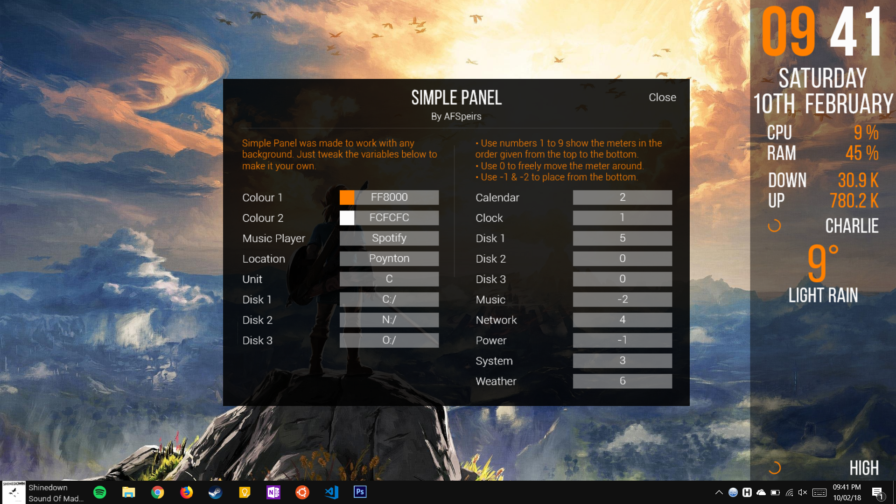

# SimplePanel
A [Rainmeter](https://www.rainmeter.net) skin that shows information at a glance in a panel that shows regardless of the background image.

## Install
Clone repo into `\Documents\Rainmeter\Skins\SimplePanel`

## Dependencies
If you wish to use the Spotify skins you will need the [Spotify Plugin](https://forum.rainmeter.net/viewtopic.php?f=18&t=17077)

## Skins
### Calendar
A simple calendar skin showing the weekday, day and the month

### Clock
A simple clock skin that shows the time. It shows the seconds on hover.

### Disk Usage
3 skins showing storage space free on disk 1 (configured in the Settings skin)

### Network
A skin that shows the upload and download speed of the network, also displays a graph on click.

### Power
A skin displaying the remaining power of the device.

### Settings
The place to configure the rest of the skins

### System
Shows the CPU and RAM usage, also displays a graph on click.

### Weather
A simple skin displaying the weather. The location and unit are configurable in the Settings skin

## Known issues:
* The weather skin will display odd characters, instead of the degree symbol (°), if not saved in ANSI (Windows 1252) format.
